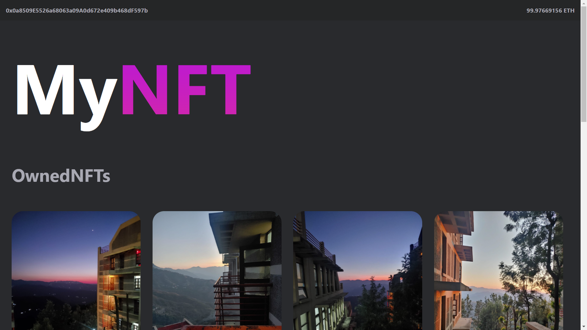
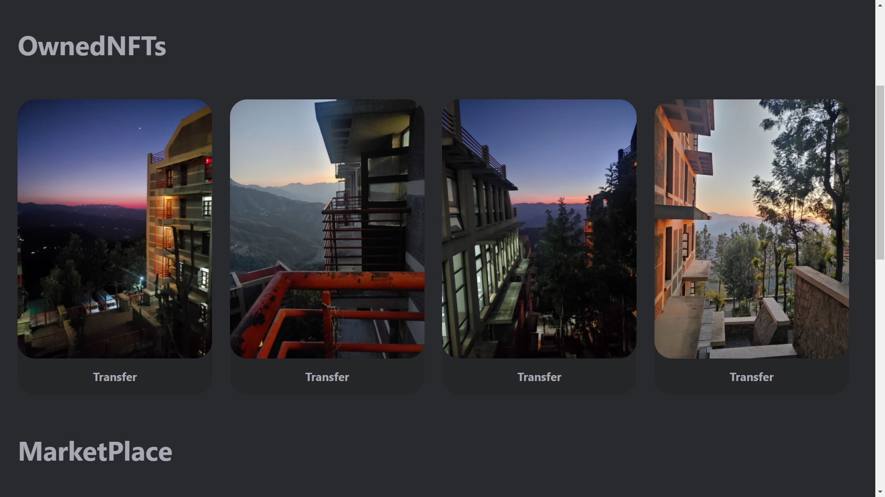
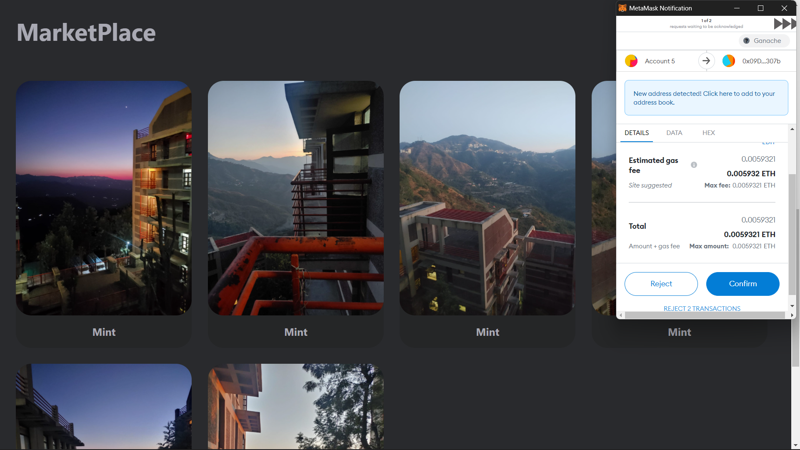
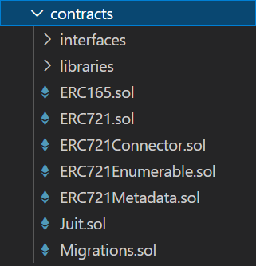

# MyNft Mint-Transfer Nft

A proper full stack web3 application. 
Proper Implementation of ERC721 and ERC165 standards for the smart contracts.
Frontend on ReactJs made use of the web3js library to intract with the smart contract.

The project is not hosted yet,
I am not an artist so just uploaded random pics as nft.

